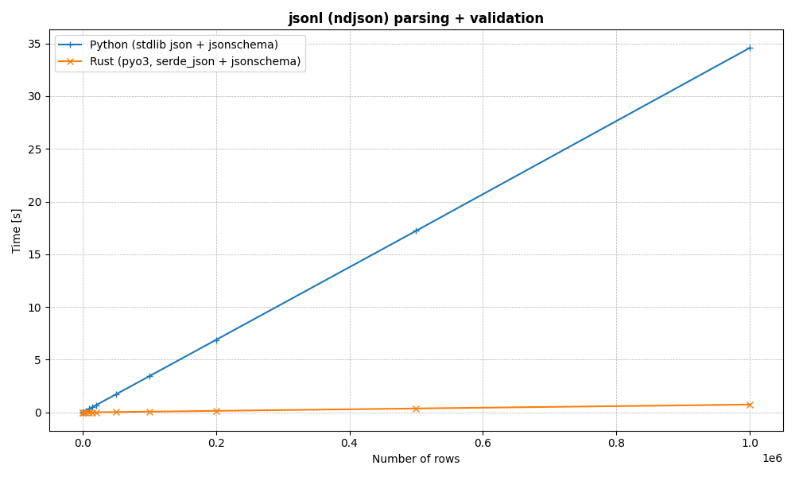

# fastjsonl

Blazingly fast jsonl parsing and validating.

What are the goals of this repo?

Polars and Pyarrow both implement extremely fast and
efficient ndjson parsing functions - however, these
do not validate the underlying (potentially nested)
json against a defined schema, other than just
potentially checking/inferring datatypes.

So - can we build a really efficient program for reading,
parsing, and validating a jsonl (newline-delimited json)
file with support for arrow format output? Yes - **fastjsonl**

### Benchmarks

Some initial testing
- Python stdlib json + jsonschema module => ~23k rows / second
- Rust pyo3, serde_json + jsonschema crate => ~1.3 million rows / second

