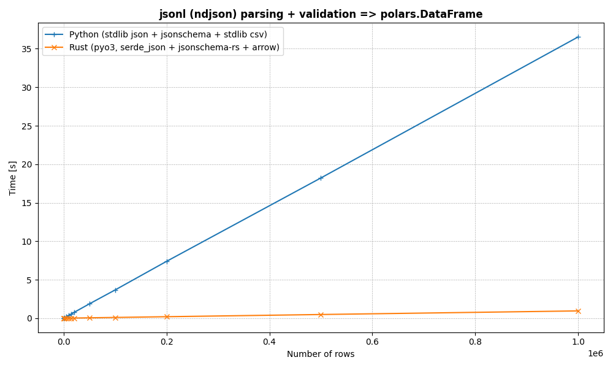

# fastjsonl

Blazingly fast jsonl parsing and validating.

What are the goals of this repo?

Polars and Pyarrow both implement extremely fast and
efficient ndjson parsing functions - however, these
do not validate the underlying (potentially nested)
json against a defined schema, other than just
potentially checking/inferring datatypes.

So - can we build a really efficient program for reading,
parsing, and validating a jsonl (newline-delimited json)
file with support for arrow format output? Yes - **fastjsonl**


### Benchmarks

Timings

```
 - [ 10        ] PYTHON ...   0.0028 seconds (   3517.0 rows / second)
 - [ 10        ] RUST   ...   0.0152 seconds (    659.0 rows / second)
 - [ 100       ] PYTHON ...   0.0041 seconds (  24300.2 rows / second)
 - [ 100       ] RUST   ...   0.0002 seconds ( 435511.6 rows / second)
 - [ 1000      ] PYTHON ...   0.0370 seconds (  27017.7 rows / second)
 - [ 1000      ] RUST   ...   0.0012 seconds ( 803304.5 rows / second)
 - [ 5000      ] PYTHON ...   0.1836 seconds (  27232.8 rows / second)
 - [ 5000      ] RUST   ...   0.0056 seconds ( 897701.2 rows / second)
 - [ 10000     ] PYTHON ...   0.3640 seconds (  27476.1 rows / second)
 - [ 10000     ] RUST   ...   0.0110 seconds ( 913006.0 rows / second)
 - [ 15000     ] PYTHON ...   0.5531 seconds (  27120.6 rows / second)
 - [ 15000     ] RUST   ...   0.0166 seconds ( 905672.0 rows / second)
 - [ 20000     ] PYTHON ...   0.7474 seconds (  26757.9 rows / second)
 - [ 20000     ] RUST   ...   0.0197 seconds (1014986.3 rows / second)
 - [ 50000     ] PYTHON ...   1.8614 seconds (  26862.1 rows / second)
 - [ 50000     ] RUST   ...   0.0497 seconds (1006648.6 rows / second)
 - [ 100000    ] PYTHON ...   3.6678 seconds (  27264.7 rows / second)
 - [ 100000    ] RUST   ...   0.0969 seconds (1031577.3 rows / second)
 - [ 200000    ] PYTHON ...   7.3841 seconds (  27085.3 rows / second)
 - [ 200000    ] RUST   ...   0.1924 seconds (1039254.1 rows / second)
 - [ 500000    ] PYTHON ...  18.2168 seconds (  27447.1 rows / second)
 - [ 500000    ] RUST   ...   0.4789 seconds (1044026.4 rows / second)
 - [ 1000000   ] PYTHON ...  36.5321 seconds (  27373.2 rows / second)
 - [ 1000000   ] RUST   ...   0.9473 seconds (1055643.5 rows / second)
```



Some initial testing
- Python stdlib json + jsonschema module => ~23k rows / second
- Rust pyo3, serde_json + jsonschema crate => ~1.3 million rows / second


